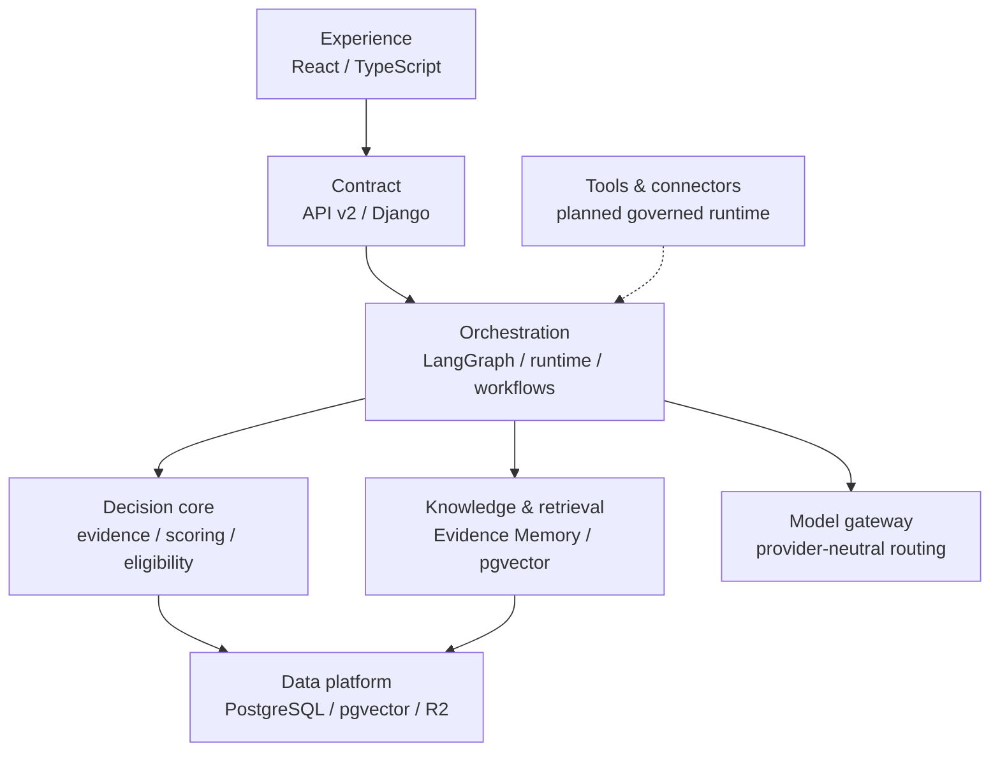

# EcoIQ AI Decision & Governance OS

## Purpose

EcoIQ is a layered decision-intelligence platform, not a single chatbot and
not a collection of interchangeable agent frameworks. The architecture keeps
deterministic decisions, retrieved evidence, generative model output and human
approval distinct so each can be evaluated and audited on its own terms.

The machine-readable authority is
`platform_registry/architecture.py`. Component status is resolved from
`platform_registry/agents.py`; this document explains the shape and the
boundaries but does not own maturity labels.

## Runtime shape

Cross-cutting controls apply to the entire flow:

- trust, safety and human approval;
- provenance, observability and audit;
- institutional memory with scoped retrieval.

## Layer status

| Layer | Current state | Authority | Honest boundary |
|---|---|---|---|
| Experience & API | Active | `frontend/web/`, `api/v2_*`, `core/spa.py` | One origin; session authentication; API v2 is canonical for new work. |
| Orchestration & workflow | Partial | `agent_runtime_model_router/`, `langgraph_orchestration/`, `backend_intelligence_engine/` | Code and tests exist; the Render blueprint has no Redis/worker process. |
| Decision intelligence core | Active | `companies/`, `ethics/`, `financing/`, `qdf/`, `mizan/` | Deterministic engines are not evidence that generative AI is evaluated. |
| Knowledge & retrieval | Partial | `evidence_memory/`, `ingestion/` | Retrieval is real and access-filtered; relevance has no labelled evaluation set. |
| Model gateway | Partial | `ai_gateway/`, `agent_runtime_model_router/services/model_router.py` | Two routing surfaces exist and must be consolidated only with compatibility evidence. |
| Tools / MCP / connectors | Planned | `api_integration_layer/`, `.mcp.json` | The current integration page is a blueprint. Development MCP config is not a product runtime. |
| Data platform | Active | `ecoiq/settings.py`, `evidence_memory/models.py`, `core/storage.py` | PostgreSQL is authoritative; vectors do not replace structured provenance. |

`ACTIVE`, `PARTIAL` and `PLANNED` describe whether an architectural layer is
present. They do not replace module maturity (`PRODUCTION`, `BETA`,
`EXPERIMENTAL`, `PLANNED`) and must not be used as marketing claims.

## One governed request

1. API v2 authenticates the session and validates the closed request shape.
2. The orchestration layer classifies the target and selects only the nodes
   required for that request.
3. Evidence Memory retrieves records through its project/organisation
   visibility policy. Restricted or rejected evidence is not eligible merely
   because vector similarity is high.
4. Deterministic engines calculate what can be calculated and preserve
   `null` for unknown inputs.
5. If generation is required, the server-side router selects an allowed model;
   the browser cannot choose a provider, base URL or API key.
6. Schema validation, safety assertions and approval rules run before a
   consequential result can progress.
7. Provenance and Observatory records link evidence, stages and physical model
   calls without estimating missing usage data.

## Why existing modules are reused

Adding a second RAG store, agent framework, telemetry model or vector database
would split audit trails and create competing authorities. The canonical path
therefore reuses:

- PostgreSQL plus pgvector instead of a separate vector service;
- `evidence_memory` instead of a second knowledge store;
- `ai_observatory` instead of feature-specific telemetry tables;
- `agent_runtime_model_router` safety and approval gates instead of per-view
  prompt conventions;
- `langgraph_orchestration.graph.run_orchestration` as the graph entry point;
- API v2 rather than extending the legacy v1 contract.

## Prioritised gaps

1. **Propagate retrieval identity.** Generic memory search requires an active
   staff actor and a persisted project, using the same policy as outcome
   retrieval. Company/country filters do not grant access. Background AI
   analysis accepts server-supplied `requesting_user_id` and `project_id` and
   reloads both at execution time; returned evidence IDs are recorded in its
   result and source references accompany prompt context. New output remains
   project-private. Legacy LangGraph and public Decision Studio calls currently
   lack this access context and therefore receive **no memory evidence**, even
   platform-shared records. Wire authenticated project context before enabling
   retrieval there; platform sharing is not permission to publish publicly.
   Generic search excludes demo rows by default; labelled demo consumers may
   explicitly opt in. Background AI analysis uses the non-demo default.
2. **Evaluate retrieval.** Build a labelled query/evidence set and measure
   precision, recall and citation coverage.
3. **Make workflow deployment real.** Add a deliberately operated Redis and
   Celery worker only when the production cost/operations decision is made.
4. **Implement governed connectors.** Create a server-side registry with typed
   schemas, per-tool permissions, timeouts, idempotency and audit events. MCP
   may be an adapter protocol; it is not itself the permission model.
5. **Consolidate model policy.** Put `ai_gateway` and the agent runtime behind
   one compatible routing contract without breaking existing consumers.
6. **Close observability gaps.** Migrate or instrument legacy direct model
   calls so every physical invocation is visible in one place.

Kubernetes, Kafka, an additional vector database and multiple new agent
frameworks are deliberately outside this phase. None resolves a current
evidence, evaluation or deployment gap.

## API contract

`GET /api/v2/platform/` returns three related but distinct collections:

- `counters`: derived product facts;
- `modules`: code-owned module maturity;
- `architecture`: ordered layers, resolved components, implementation paths
  and known gaps.

The endpoint is public because the homepage and Labs surfaces consume platform
truth. It exposes no prompts, credentials, provider slugs, company scores or
private evidence.
