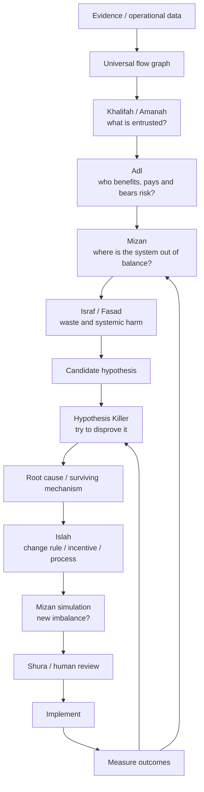

# EcoIQ Mizan + Poverty & Justice Core

## Purpose

This document makes two architectural commitments explicit:

1. **Mizan is a cross-cutting system-balance layer, not a sector-specific score.**
2. **Poverty & Justice is a causal-falsification engine, not a policy-answer bot.**

The existing `mizan/scoring.py` remains the current company/project scoring
engine. The new `mizan/system_balance.py` is a separate system-level contract
for detecting imbalances across sectors, resources, people and time without
collapsing them into one arbitrary master score.

The first Poverty & Justice implementation is intentionally narrower:
`poverty_justice/contracts.py` defines causal-test and intervention gates, and
`poverty_justice/falsification.py` defines the unevaluated falsification-service prompt contract.
No public endpoint, raw-microdata LLM path or autonomous policy action is added
in this phase.

## Core flow



## Mizan contract

Every material optimisation should be testable across the canonical dimensions:

- economic;
- resource efficiency;
- energy;
- water;
- environment;
- human;
- worker;
- social;
- justice;
- resilience;
- intergenerational.

The system does **not** compute a single moral score from these dimensions.
Known states remain explicit and missing evidence remains
`INSUFFICIENT_DATA`.

A hard constraint such as verified life safety, drinking-water security,
structural safety, law or a critical ecological threshold is not tradeable
against higher profit or a better score elsewhere.

Nested scopes are supported:

```text
asset
→ process
→ facility
→ company
→ supply chain
→ city
→ region
→ country
→ ecosystem
```

A factory can therefore be locally efficient while the region remains
water-critical. Local optimisation is not system optimisation.

## Poverty & Justice contract

The engine lifecycle is:

```text
OBSERVATION
→ HYPOTHESIS
→ EVIDENCE
→ COUNTEREVIDENCE
→ FALSIFICATION
→ COUNTEREXAMPLES
→ ROBUSTNESS
→ MECHANISM STATUS
→ ISLAH MODELLING
→ IMPACT TEST
```

A hypothesis can never have status `TRUE`. The allowed evidence lifecycle is:

```text
UNTESTED
INSUFFICIENT_DATA
ASSOCIATION_ONLY
FAILED_FALSIFICATION_1
FAILED_FALSIFICATION_2
ROBUST_ASSOCIATION
CAUSAL_SUPPORT
REPLICATED_CAUSAL_SUPPORT
REFORMULATED
REJECTED
```

Intervention gates are intentionally strict:

| Evidence state | Maximum allowed action |
|---|---|
| Below robust association | No systemic intervention |
| Robust association | Exploratory intervention modelling |
| Causal support | Policy/system simulation |
| Replicated causal support | Implementation proposal, still with human review |

## KZ-003 household causal twin

The intended Kazakhstan research unit is `HOUSEHOLD × PERIOD`, using
de-identified survey data in a secure analytics layer.

The LLM must not receive raw identifiable household rows. The intended path is:

```text
de-identified microdata
→ secure feature/statistical layer
→ aggregate test results
→ HypothesisKiller
→ human/domain review
```

Candidate dimensions include household size, children, earners, urban/rural,
income decile, employment, debt burden, housing, region, essential costs and
survey weights. Variables are only enabled when the source codebook supports
them.

## Falsification principle

The engine is rewarded for destroying weak explanations, not defending them.

For every candidate mechanism it should search for:

- reverse causality;
- confounding;
- selection bias;
- measurement error;
- temporal mismatch;
- ecological fallacy;
- counterexamples;
- subgroup instability;
- failed out-of-sample replication;
- credible alternative mechanisms.

For example, `debt → poverty` is not accepted merely because debt is present.
The refined question may instead be whether debt service relative to free
household capacity amplifies vulnerability after a shock.

## Sector integration

Mizan is cross-cutting across all EcoIQ sectors, including mining, minerals,
oil and gas, processing, metallurgy, manufacturing, assembly, energy, water,
agriculture, construction, transport, finance, government, healthcare,
education and households.

The same pattern applies everywhere:

```text
RULE
→ INCENTIVE
→ BEHAVIOUR
→ FLOW
→ OUTCOME
→ BENEFIT / COST / RISK / HARM
→ MIZAN
```

When an imbalance survives evidence review:

```text
DESIRED BALANCE
→ DESIRED OUTCOME
→ DESIRED FLOW
→ BEHAVIOUR
→ INCENTIVE
→ NEW RULE
```

## Safety and governance

This layer must not:

- issue fatwas;
- infer sin, belief or intent;
- invent Qur'an, hadith or scholarly positions;
- turn regional correlations into household causes;
- treat inequality alone as proof of injustice;
- expose raw PII to a generative model;
- authorise coercive or high-impact action without human review.

Shariah-informed analysis is an evidence and governance layer. Recognised
scholarly disagreement remains visible and requires qualified review.

## Current implementation status

Implemented in this change:

- deterministic system-level Mizan contract;
- tests for unknown propagation, hard constraints and trade-off review;
- Poverty & Justice causal-test contracts and intervention gates;
- falsification-service prompt specification;
- architecture registry integration.

Not implemented yet:

- raw Kazakhstan microdata ingestion;
- PostgreSQL household/hypothesis models;
- causal estimators;
- runtime LLM invocation;
- public API/UI;
- policy simulator;
- production evaluation of the falsification service.

Those remain separate, reviewable changes.
