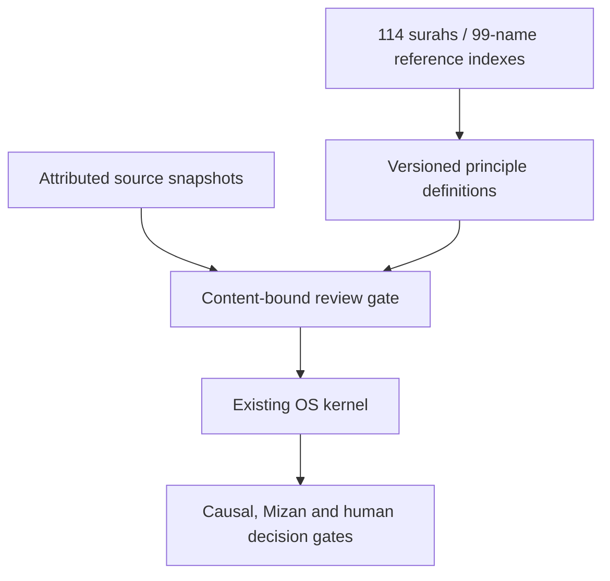

# Wisdom, justice and governed Islamic knowledge

## Implemented boundary

EcoIQ keeps one deterministic OS. `islamic_knowledge/` is a knowledge-contract
service used by optional `EcoIQOSCase.knowledge` bindings. It does not own
scoring, orchestration, Mizan, causal inference, permissions or implementation.
There is no additional runtime dependency, database migration, network fetch,
model call or public interpretation endpoint.



| Concern | Authority | Implemented behaviour |
|---|---|---|
| Surah/ayah locator | `islamic_knowledge/catalog.py` | Validates standard Hafs boundaries and ranges; rejects invented chapter/verse numbers and boolean IDs. |
| 114-surah metadata | `content/islamic_knowledge/quran_index.json` | Arabic names, transliteration, ayah counts; derived from existing Tazkiyah metadata without copying reflection text. |
| 99-name inventory | `content/islamic_knowledge/names99.json` | Arabic identifiers and transliteration with enumeration, attribution and pending review; no meanings or authoritative interpretation. |
| Source classes | `islamic_knowledge/contracts.py` | Quran text, translation, tafsir, hadith, scholarly position, operationalisation and AI inference remain distinct. |
| Source provenance | `SourceRecord` | Exact passage hash, edition, language, attribution, locator, version, rights and authentication state. |
| Review binding | `review_digest` / `ReviewReceipt` | Approval binds all definition fields, positions and complete source snapshots; edits require a new review. |
| Wisdom / justice | `islamic_knowledge/principles.py` | Draft operational questions with valid source locators; no invented passages or reviewers. |
| OS progression | `ecoiq_os/kernel.py` | Rechecks every optional binding; unready knowledge blocks automatic progression, while causal permission remains unchanged. |
| Readiness | `platform_registry/` | Contract service is BETA; architecture is PARTIAL; reviewed corpus and runtime adapters remain gaps. |

The reference loaders cache one immutable index per process. The indexes and
records cannot be mutated by consumers. Restart the process after changing a
catalogue; these are release-owned reference files, not a mutable CMS.

## Wisdom and justice in operational terms

Hikmah asks for context, alternatives, uncertainty and longer-term consequences.
Adl asks who creates/receives value, pays, bears risk, decides and can appeal.
These are **EcoIQ-authored operationalisations awaiting scholarly review**.
They do not claim that a verse mandates an engineering formula, that unequal
outcomes prove injustice, or that a company has a measurable level of faith.

The draft catalogue also locates Khalifah, Amanah, Maqasid, Mizan, Israf, Fasad,
Islah, Ihsan and Shura inside the existing lifecycle. None of these drafts can
pass `assess_definition`: their source snapshots and review receipts are absent.
The verse locators aid a reviewer; they are not a substitute for sourced text,
context, interpretation or real-world evidence.

## The 99-name enumeration

The reference inventory follows the enumeration displayed for
[Jami at-Tirmidhi 3507](https://sunnah.com/tirmidhi:3507), including `Allah` at
ordinal 1. This specific listing is marked **Da'if (Darussalam)** by the source.
It is stored with that attribution and `scholar_review_pending`, not silently
labelled authentic. Other enumerations differ; ordinals belong to this variant
and do not represent ranking or an exhaustive theological claim.

[Sahih al-Bukhari 7392](https://sunnah.com/bukhari:7392) attests the number
without this enumeration. [Quran 7:180](https://quran.com/7/180) and
[59:22–24](https://quran.com/59/22-24) are additional reference entry points.
No source translation or tafsir passage has been copied into the index.
Individual meanings, authentication and operational bindings still need review.
A definition using a name key always receives
`DIVINE_NAME_INTERPRETATION_REVIEW_REQUIRED` while this inventory is pending.

Wisdom/justice reviewer entry points include
[2:269](https://quran.com/2/269), [4:135](https://quran.com/4/135),
[5:8](https://quran.com/5/8), and [16:90](https://quran.com/16/90).
Reference links checked on 2026-10-07; catalogue entries are not externally
certified. No translator licence or qualified reviewer is inferred from a URL.

## Gate behaviour

`assess_definition` returns stable reason codes and the current content digest.
The kernel namespaces each reason with its definition ID. It blocks on:

- missing sources, missing referenced positions or source identity mismatch;
- revoked sources, pending rights, disputed/unverified authentication;
- AI inference presented as religious evidence, or an operationalisation citing
  only itself;
- Quran locators without the corresponding source reference;
- absent, revoked, stale or future-dated scholarly approval;
- sensitive content without both scholar and wellbeing approval;
- multiple scholarly positions, preserving rather than resolving disagreement;
- unreviewed divine-name interpretation.

A matching scholar receipt permits consideration only. It never grants a fatwa,
Shariah certification, publication permission, implementation authority or an
upgrade from association to causation. Hard Mizan constraints stay first.
Existing cases without knowledge bindings continue to use the original lifecycle.

**Trust boundary:** these are internal validation contracts, not signatures or
an authentication system. Callers must obtain source versions, authentication
states and receipts from the permission-checked provenance/reviewer store.
Never accept `verified`, a reviewer role or an approval digest from an API
request, model response or retrieved document. That persistence/authentication
adapter is not implemented and no public API accepts these records.
Receipts must be supplied in their current revocation state on every call.
Text is inert data; the layer does not execute source-embedded instructions.

A valid locator and a matching hash establish identity and integrity, not
accuracy, entailment or legitimate interpretation. Full invented-verse text
verification requires a licensed, versioned canonical corpus; that corpus and
independent religious evaluation remain future work.

## Core fixes accompanying the boundary

Known flow quantities and Mizan values/thresholds now reject NaN, infinities,
booleans and non-numeric inputs; missing values remain `None` and measured zero
remains valid. Duplicate detection in flow graphs and Mizan dimensions uses
one counting pass rather than repeated scans. Sorting duplicate diagnostics
remains deterministic; the counting cost changes from quadratic to linear.

Mizan still reports the worst **known** dimension, preserving its existing
assessment contract. The kernel now also checks explicitly unknown dimensions
before progression: healthy economics cannot hide unassessed justice or water.
This does not invent missing dimensions or alter legacy/public company scores.

## Reproduction and remaining integration

```bash
python -m unittest islamic_knowledge.test_contracts ecoiq_os.test_knowledge \
  ecoiq_os.test_kernel mizan.test_system_balance
DEBUG=True python manage.py test islamic_knowledge ecoiq_os \
  mizan.test_system_balance platform_registry api.tests_v2_platform \
  core.tests_tazkiyah_seeds --noinput
ruff check .
python manage.py check
python manage.py makemigrations --check --dry-run
```

Before exposing interpretive decision features: connect authenticated source and
reviewer storage, obtain rights, independently validate the catalogues, source
and review each operationalisation and recognised scholarly position, and run
religious retrieval/interpretation evaluation. Reuse existing provenance,
project access, Mizan and human approval services rather than add parallel stores.

The attached old Render PR #220 is still conflicted. Current `main` declares a
Free web service and omits the existing database plan under its later low-cost
migration runbook. Importing #220's historic Standard web plan would reverse
that newer configuration. This increment does not change Render plans or deploy.
